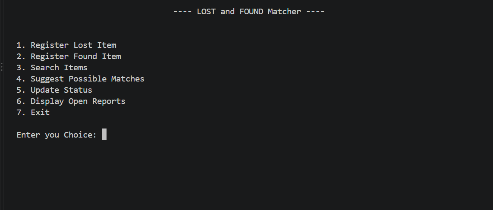
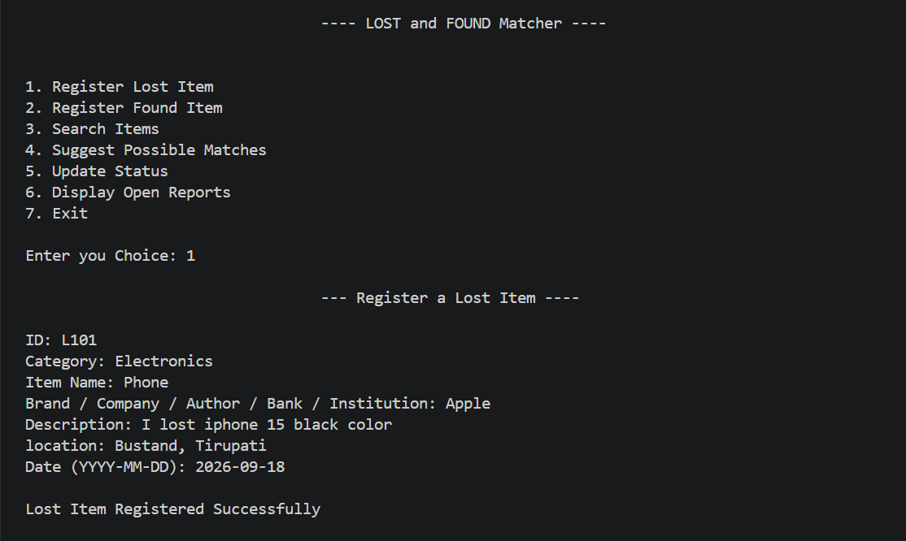
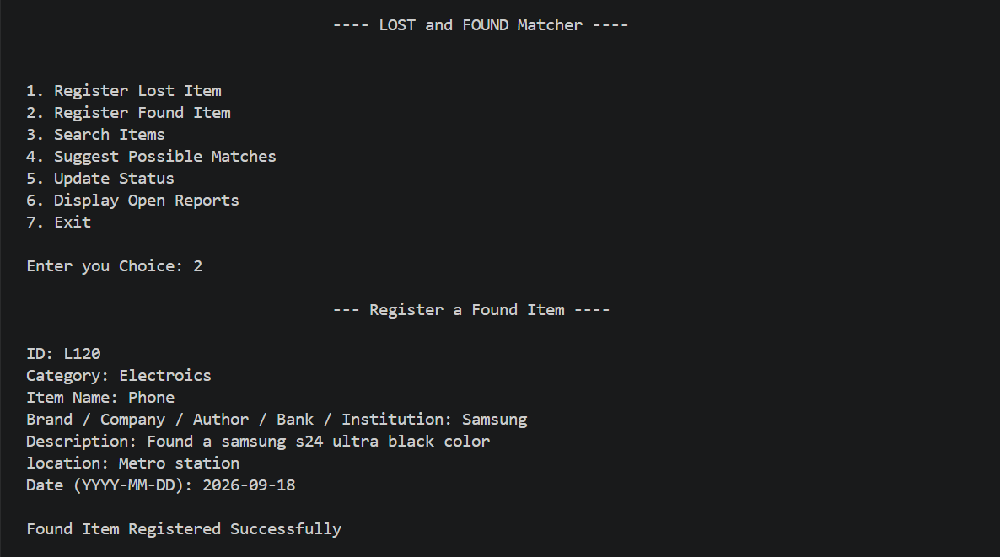
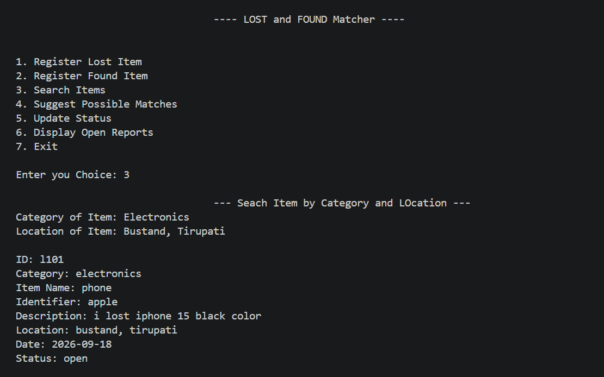
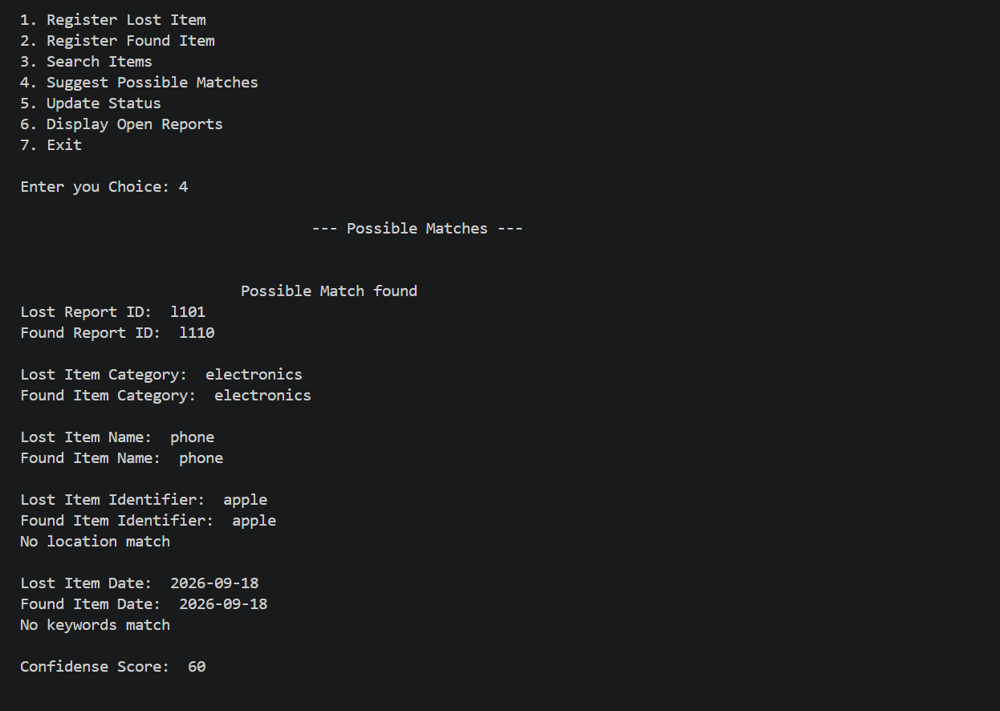
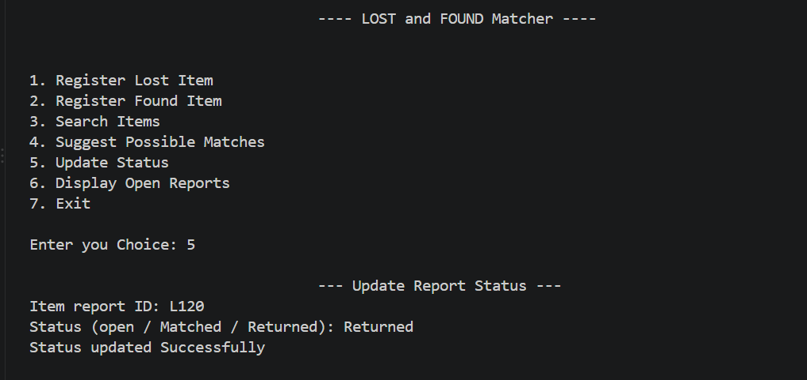
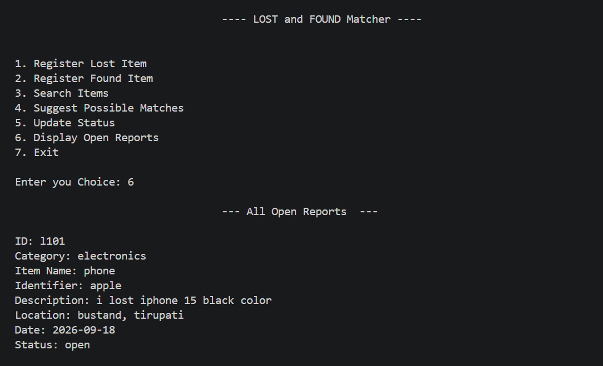

[README.md](https://github.com/user-attachments/files/32379718/README.md)
# 🔎 Lost and Found Matcher

A **Python-based console application** designed to manage lost and found item reports and identify possible matches between lost and found items.

The application allows users to register lost and found items, validate the entered information, search reports based on category and location, compare lost and found reports, calculate a matching score, update report statuses, and display currently open reports.

The matching system uses predefined criteria such as **category, item name, identifier, location, date, and common keywords from item descriptions**.

---

## 🎯 Project Objective

The main objective of this project is to create a simple system that can help users identify possible matches between lost and found items.

For example, if a user reports a lost mobile phone and another user reports finding a similar mobile phone, the application compares the details of both reports and calculates a matching score.

The system then displays the report as a **possible match** when the score reaches the defined matching threshold.


The application allows users to:

- 📝 Register lost items
- 📦 Register found items
- 🔍 Search items by category and location
- 🤝 Compare lost and found reports
- 🧮 Calculate a matching score
- 🔑 Compare description keywords
- 🔄 Update report status
- 📋 Display all currently open reports

The project currently stores all records **in memory using Python lists and dictionaries**.

---

## ✨ Features

### 1. 📝 Register Lost Item

Users can register an item that has been lost by providing:

- 🆔 Item Report ID
- 🏷️ Category
- 📦 Item Name
- 🏢 Brand / Company / Author / Bank / Institution
- 📝 Description
- 📍 Location
- 📅 Date

Each lost item is stored with the default status:

```text
open
```

---

### 2. 📦 Register Found Item

Users can register an item that has been found using the same information fields as a lost item.

The found report is also stored with the default status:

```text
open
```

---

### 3. 🔍 Search Items

Users can search for registered reports using:

- 🏷️ Category
- 📍 Location

The application searches both lost and found records and displays matching reports.

The search is performed after converting the input to lowercase and removing extra spaces.

---

### 4. 🤝 Suggest Possible Matches

The application compares open lost reports with open found reports.

For every possible pair, it calculates a matching score based on:

- 🏷️ Category
- 📦 Item name
- 🏢 Identifier
- 📍 Location
- 📅 Date
- 🔑 Common description keywords

A possible match is displayed when the score is **50 or higher**.

---

### 5. 🧮 Score-Based Matching

The matching system uses a maximum score of **100 points**.

| Matching Criteria | Points |
|---|---:|
| Category | 20 |
| Item Name | 20 |
| Identifier | 10 |
| Location | 10 |
| Date | 10 |
| 3 or more common description keywords | 30 |
| Some common description keywords | 10 |
| No common keywords | 0 |
| **Maximum Score** | **100** |

The score is calculated using exact comparisons for the structured fields.

---

### 6. 🔑 Keyword Matching

The application compares words from the lost item's description with words from the found item's description.

Python sets are used to find common words:

```python
common_keywords = lost_keywords & found_keywords
```

The keyword result can be:

- ✅ **Fully matched** — both descriptions contain the same set of keywords
- 🟡 **Partially matched** — some common keywords are present
- ❌ **No keywords match** — no common keywords are found

---

### 7. 🔄 Update Report Status

Users can update the status of a lost or found report.

Available statuses are:

```text
open
matched
returned
```

The application first checks whether the entered status is valid and then searches for the given report ID.

---

### 8. 📋 Display Open Reports

Users can display all reports that currently have:

```text
status = open
```

Both lost and found reports are checked.

---

### 9. ✅ Input Validation

The application validates required fields while registering an item.

The following fields cannot be empty:

- Item ID
- Category
- Item Name
- Identifier
- Description
- Location

Search also checks that both category and location are provided.

---

### 10. 📅 Date Validation

The application validates dates using Python's `datetime` module.

The required date format is:

```text
YYYY-MM-DD
```

Example:

```text
2026-09-18
```

Invalid date formats are rejected.

---

### 11. 🚪 Exit

The application provides an exit option through the main menu.

When the user selects option `7`, the program terminates.

---

## 🛠️ Technologies and Concepts Used

### 💻 Programming Language

- 🐍 Python

### 📚 Python Concepts

- Variables
- Data types
- Strings
- Lists
- Dictionaries
- Sets
- Functions
- `if`, `elif`, `else`
- `for` loops
- `while` loops
- String methods
- Set intersection
- Input validation
- Exception handling
- `datetime`
- Basic rule-based scoring

---

## 📦 Python Module Used

The project uses Python's built-in `datetime` module:

```python
from datetime import datetime
```

It is used to validate the entered date.

No external Python packages are required.

---

## ⚙️ How the Application Works

The application starts with the main menu.

```text
---- LOST and FOUND Matcher ----

1. Register Lost Item
2. Register Found Item
3. Search Items
4. Suggest Possible Matches
5. Update Status
6. Display Open Reports
7. Exit
```

The user selects an option and the corresponding function is executed.

---

 
## 🧮 Example Matching Calculation

Suppose a lost report and a found report have:

```text
Category      → Same       = 20 points
Item Name     → Same       = 20 points
Identifier    → Same       = 10 points
Location      → Same       = 10 points
Date          → Same       = 10 points
Keywords      → 3+ common = 30 points
```

Total:

```text
20 + 20 + 10 + 10 + 10 + 30 = 100
```

Since the score is greater than or equal to `50`, the application reports it as a possible match.

---

## 📊 Matching Criteria

The application compares the following information:

```text
Lost Report
    │
    ├── Category
    ├── Item Name
    ├── Identifier
    ├── Location
    ├── Date
    └── Description Keywords
             │
             ▼
       Compare with
             │
             ▼
Found Report
    │
    ├── Category
    ├── Item Name
    ├── Identifier
    ├── Location
    ├── Date
    └── Description Keywords
```

Only reports with an `open` status are considered during possible-match checking.

---

## 📋 Report Status

Each report contains a status field.

### 🟢 Open

The report is still active and can be considered for matching.

### 🟡 Matched

The report has been identified as a match.

### 🔵 Returned

The item has been returned.

Valid values accepted by the application are:

```text
open
matched
returned
```

---

## 🗃️ Data Storage

Currently, the application stores data in two Python lists:

```python
lost_items = []
found_items = []
```

Each report is stored as a Python dictionary.

Example:

```python
{
    "item_id": "l001",
    "category": "electronics",
    "item_name": "mobile phone",
    "identifier": "samsung",
    "description": "black samsung phone with cracked screen",
    "location": "tirupati bus stand",
    "date": "2026-09-18",
    "status": "open"
}
```

### ⚠️ Important

The current version does **not** use file handling or a database.

Therefore, registered records are available only while the program is running. When the application is closed, the in-memory records are lost.

---

## 📸 Output Screenshots

Screenshots of the application can be stored inside the `screenshots` folder and displayed directly in this README.

### 🏠 Main Menu



### 📝 Register Lost Item



### 📦 Register Found Item



### 🔍 Search Items



### 🤝 Possible Match



### 🔄 Update Report Status



### 📋 Open Reports



---

## 🚀 How to Run

### 1️⃣ Install Python

Make sure Python is installed on your computer.

Check the installed version:

```bash
python --version
```

or:

```bash
py --version
```

---

### 2️⃣ Clone the Repository

```bash
git clone https://github.com/DandumaniGowtham/Lost-and-Founder.git
```

---

### 3️⃣ Open the Project Folder

```bash
cd Lost-and-Founder
```

---

### 4️⃣ Run the Python Program

If the Python file is named:

```text
Lost_and_Found_Matcher.py
```

run:

```bash
python Lost_and_Found_Matcher.py
```

---

## 📁 Project Structure

```text
Lost-and-Founder/
│
├── Lost_and_Found_Matcher.py
│
├── output_images/
│   ├── all_open_reports.png
│   ├── exit.png
│   ├── invalid_choice.png
│   ├── main_menu.png
│   ├── possible_match.png
│   ├── register_found_item.png
│   ├── register_lost_item.png
│   ├── search_by_category.png
│   └── update_report_status.png
│
└── README.md
```
---

## ⚠️ Current Limitations

The current version is a basic console application and has some limitations:

- 💾 Data is stored only in memory
- 🗄️ No database is connected
- 📄 No file persistence
- 🖥️ No graphical user interface
- 🌐 No web application
- 👤 No user authentication
- 📧 No email or notification system
- 🔎 Search currently uses exact category and location matching
- 🧮 Matching is based on predefined rules rather than machine learning

---

## 🔮 Future Improvements

The project can be extended with:

### 💾 Persistent Storage

Add JSON, CSV, SQLite, PostgreSQL, or MongoDB storage so that reports remain available after the application closes.

### 🖥️ GUI

Build a graphical interface using technologies such as:

- Tkinter
- PyQt
- CustomTkinter

### 🌐 Web Application

Convert the project into a web application using:

- Flask
- Django
- FastAPI

### 🗄️ Database Integration

Store lost and found reports in a database.

### 👤 User Authentication

Add login and registration functionality for users.

### 📷 Image Upload

Allow users to upload pictures of lost and found items.

### 🧠 Advanced Matching

Improve matching using:

- Text similarity
- Natural Language Processing
- Machine Learning
- Semantic similarity

### 📱 Notifications

Notify users when a possible match is found.

---

## 📚 Learning Outcomes

This project helped demonstrate practical usage of:

- 🐍 Python programming
- 🧩 Functions and modular programming
- 📋 Lists and dictionaries
- 🔑 Sets and set operations
- 🔄 Loops and conditional statements
- 🧹 String cleaning using `strip()` and `lower()`
- 🛡️ Input validation
- ⚠️ Exception handling
- 📅 Date validation
- 🧮 Rule-based scoring
- 🔍 Searching and comparing records
- 🧠 Basic problem-solving and application logic
- 📂 Project organization
- 🐙 Git and GitHub

---

## 🧑‍💻 Author

**DANDUMANI GOWTHAM**

🎓 B.Tech – Computer Science and Engineering

🐍 Python | ☕ Java | ⚡Express.js | 🔗 REST API | 🗄️ SQL | 🍃 MongoDB 

---


